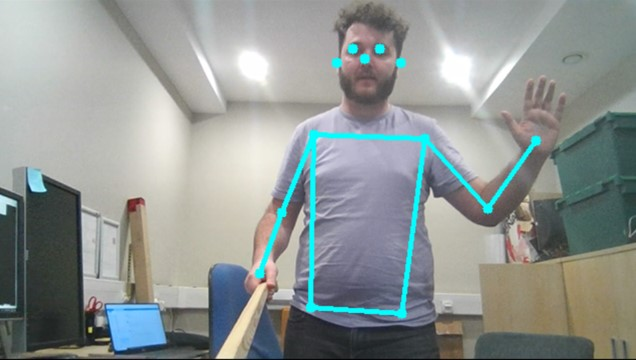

# posenet-python
Lightweight CPU or GPU pose estimation using TensorflowLite

<p align="center">

</p>

## Installation

The code has been tested to work on a python 3.7 distribution, the minimal installation of [miniconda](https://docs.conda.io/en/latest/miniconda.html) should be sufficient.

Once installed open a command window and create a python 3.7 environent, for example called _posenet_.
```
conda create --name posenet python=3.7
```

If that has succesfully worked enter the posenet environment.
```
conda activate posenet
```

We now need to install some dependencies from conda and pip
``` 
conda install numpy
conda install tensorflow
pip install opencv-python==3.4.5.20
```
**Note:** installing opencv through conda _might_ work for the pose estimation, but Anaconda's default opencv does not include ffpmeg/VideoCapture support, which is needed for capturing poses using a webcam. 

Finally, you need the compiled model which estimates the poses from images or frames of video, download the model from [here](https://www.tensorflow.org/lite/models/pose_estimation/overview) or alternatively or save this [direct link](https://storage.googleapis.com/download.tensorflow.org/models/tflite/posenet_mobilenet_v1_100_257x257_multi_kpt_stripped.tflite) 


## Testing

To get the test code to run you'll need to specify the path to the model, this can be done when the poser itself is initilaised e.g.

```
poser = posenet.Poser();
poser.setup(model_path='C:/path/to/posenet_mobilenet_v1_100_257x257_multi_kpt_stripped.tflite');
```

Edit the line in webcam_test.py to accomodate where your model is saved, and that should be it.

To run the webcam test code, run the following

```
python webcam_test.py
```
